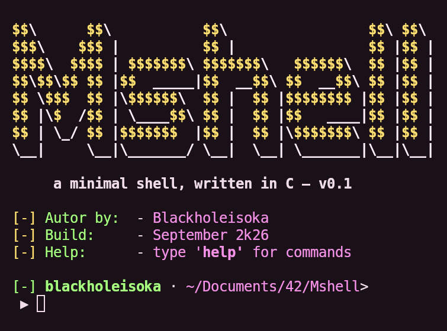
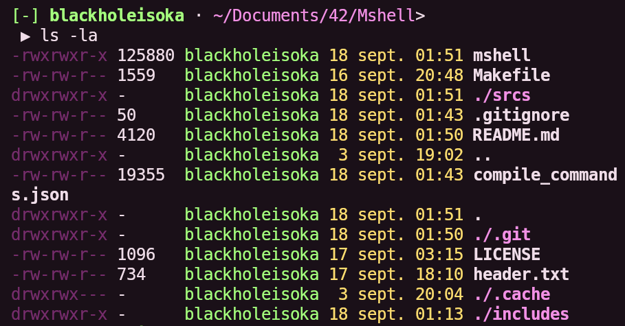
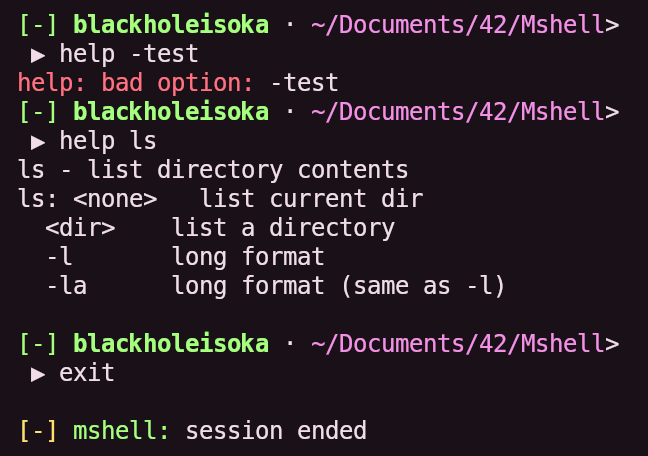

<div align="center">

```
$$\      $$\           $$\                 $$\ $$\
$$$\    $$$ |          $$ |                $$ |$$ |
$$$$\  $$$$ | $$$$$$$\ $$$$$$$\   $$$$$$\  $$ |$$ |
$$\$$\$$ $$ |$$  _____|$$  __$$\ $$  __$$\ $$ |$$ |
$$ \$$$  $$ |\$$$$$$\  $$ |  $$ |$$$$$$$$ |$$ |$$ |
$$ |\$  /$$ | \____$$\ $$ |  $$ |$$   ____|$$ |$$ |
$$ | \_/ $$ |$$$$$$$  |$$ |  $$ |\$$$$$$$\ $$ |$$ |
\__|     \__|\_______/ \__|  \__| \_______|\__|\__|
```

# Mshell

**A minimal shell written from scratch in C.**

*35+ built-in commands · colored output · persistent history · no external libraries*


</div>

---

## About

Mshell is a hand-made command-line shell built entirely from scratch in C, without relying on any external library. Every command — from `ls` to `grep`, `sort` and `rm -r` — was reimplemented using raw system calls (`read`, `write`, `open`, `stat`, `readdir`, `fork`…).

The project started as a way to understand how a real shell works under the hood, and grew into a full toolbox of 35+ commands with colored output, aligned columns, glob expansion and a persistent command history.

> Personal learning project — separate from the 42 cursus Minishell.

---

## Preview

<div align="center">

### Launch & header


### Colored `ls -l`


### Built-in commands (`help`)


</div>

---

## Features

- **35+ built-in commands** reimplemented from scratch
- **Colored output** — prompt, errors, directories, permissions
- **Glob expansion** — `cat *`, `cat *.c`
- **Persistent history** — stored in `~/.history`, survives sessions
- **Aligned columns** — `ls -l` and `help` output are properly padded
- **Recursive operations** — `rm -r` walks the whole tree
- **Zero external dependencies** — only libc and system calls

---

## Build & run

```bash
git clone git@github.com:Blackholeisoka/Mshell.git
cd Mshell
make
./mshell
```

Type `help` inside the shell to list every command, or `help <command>` for details.

---

## Commands

| Category | Commands |
|----------|----------|
| **Navigation** | `pwd` · `cd` · `ls` (`-l` `-la`) · `clear` |
| **Files** | `cat` (glob) · `touch` · `cp` · `mv` · `rm` (`-r`) · `ln` (`-s`) · `chmod` |
| **Directories** | `mkdir` · `rmdir` |
| **Text** | `echo` (`-n`) · `head` (`-n`) · `tail` (`-n`) · `wc` (`-l` `-c`) · `grep` (`-n` `-v`) · `sort` (`-r`) · `uniq` (`-d` `-u`) · `tac` · `rev` · `diff` |
| **Path** | `basename` · `dirname` |
| **System** | `whoami` · `env` · `printenv` · `export` · `which` · `date` · `kill` |
| **Shell** | `history` (`-c`) · `help` · `exit` |

---

## Architecture

```
Mshell/
├── includes/
│   └── ft_tools.h        # prototypes, structs, color & macro defines
├── srcs/
│   ├── ft_main.c         # REPL loop, prompt, history write
│   ├── ft_parse.c        # command dispatch table
│   ├── ft_split.c        # tokenizer
│   ├── ft_utils.c        # string helpers, file I/O, colored header
│   └── ft_<command>.c    # one file per command
├── header.txt            # ASCII logo (color-tagged)
└── Makefile
```

Commands are wired through a **dispatch table** — a single array pairing each command name with its function pointer. Adding a command means writing its file, declaring it, and adding one line to the table.

---

## What I learned

- System calls for files and directories (`open`, `read`, `stat`, `readdir`, `unlink`, `rename`…)
- Recursion over a filesystem tree
- ANSI escape codes for colors and screen control
- Function pointers and dispatch tables
- Building a clean, dependency-free C project with a Makefile

---

## Author

**Blackholeisoka**
Self-taught developer.

---

## License

Released under the MIT License. See [`LICENSE`](LICENSE) for details.
